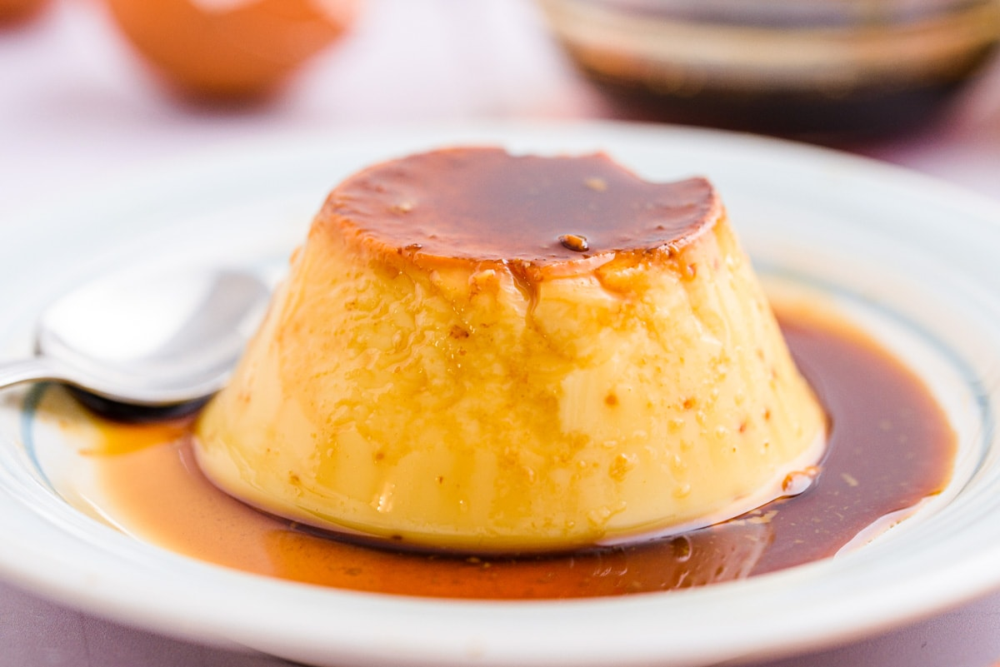

#Livre de Recettes

## Recette : flan
### Ingrédients :

- 4 œufs
- 1 litre de lait
- 150 grammes de sucre
- 1 cuillère à café d'extrait de vanille (facultatif)

### Instructions :

1. Préchauffez le four à 180°C.
2. Dans un saladier, battez les œufs.
3. Ajoutez le sucre et mélangez bien jusqu'à ce que le mélange devienne mousseux.
4. Chauffez le lait dans une casserole jusqu'à ce qu'il soit chaud mais pas bouillant.
5. Versez le lait chaud sur le mélange d'œufs et de sucre en remuant constamment.
6. Ajoutez l'extrait de vanille, si vous en utilisez.
7. Filtrez le mélange pour enlever les éventuels morceaux d'œufs non mélangés.
8. Versez le mélange dans un moule à flan ou des ramequins.
9. Placez le moule ou les ramequins dans un bain-marie (un plat plus grand rempli d'eau chaude).
10. Cuisez au four pendant environ 45 minutes ou jusqu'à ce que le flan soit pris. Pour vérifier, insérez un couteau au centre du flan ; s'il en ressort propre, le flan est cuit.
11. Laissez refroidir à température ambiante, puis réfrigérez pendant au moins quelques heures avant de servir.

### Recette image :
- Absolute URL:

- Relative URL: 

